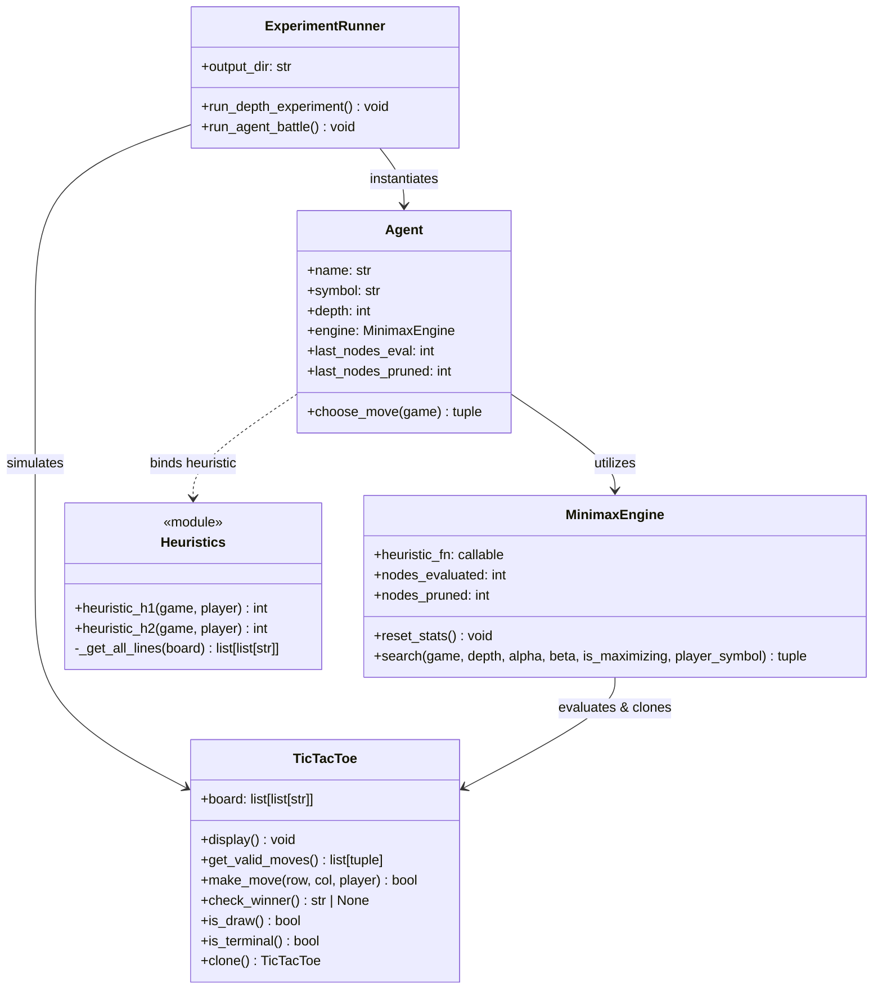
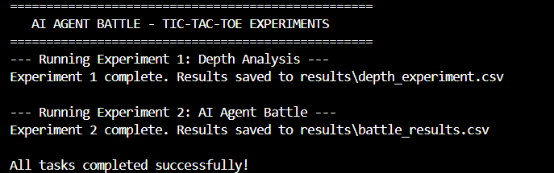
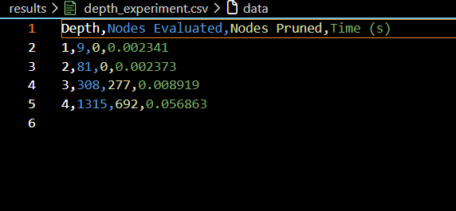
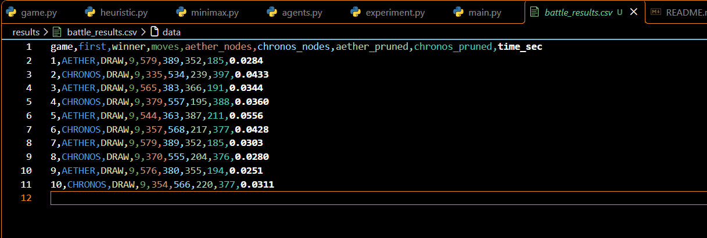
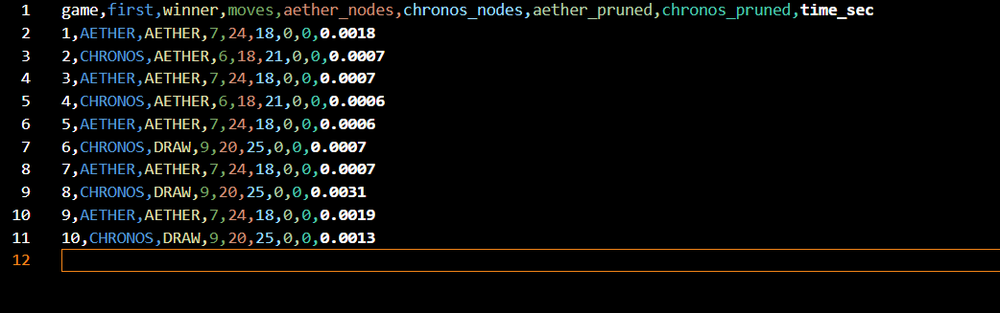
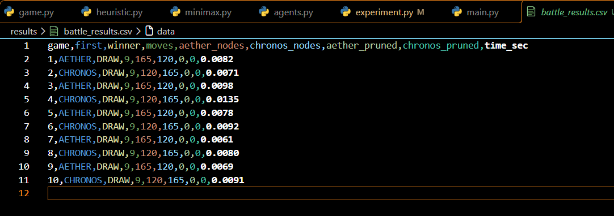

# ⚔️ AI AGENT BATTLE — TIC-TAC-TOE

[](https://www.python.org/)
[](https://github.com/)
[](https://github.com/)
[](https://en.wikipedia.org/wiki/Alpha%E2%80%93beta_pruning)
[](https://opensource.org/licenses/MIT)
[]()

> **Assignment X_02 | AI/ML Laboratory | B.Tech. 5th Semester**  
> An autonomous adversarial simulation exploring game-tree search depth, Alpha-Beta pruning performance, and heuristic evaluation functions in automated AI-versus-AI battles without human intervention.

---

## 📑 Table of Contents

- [📌 Problem Statement \& Core Inquiries](#-problem-statement--core-inquiries)
- [🏗️ System Architecture \& OOP Structure](#️-system-architecture--oop-structure)
- [🧠 Algorithmic Framework](#-algorithmic-framework)
  - [1. Minimax Algorithm](#1-minimax-algorithm)
  - [2. Alpha-Beta Pruning](#2-alpha-beta-pruning)
  - [3. Tie-Breaking Strategy](#3-tie-breaking-strategy)
- [⚖️ Heuristic Evaluation Formulations](#️-heuristic-evaluation-formulations)
  - [Heuristic 1 ($H_1$): Line \& Threat Focused (AETHER)](#heuristic-1-h_1-line--threat-focused-aether)
  - [Heuristic 2 ($H_2$): Positional \& Spatial Control (CHRONOS)](#heuristic-2-h_2-positional--spatial-control-chronos)
- [🤖 Agent Profiles](#-agent-profiles)
- [📂 Repository Structure](#-repository-structure)
- [🚀 Quick Start \& Execution Instructions](#-quick-start--execution-instructions)
  - [Prerequisites](#prerequisites)
  - [Running the Program](#running-the-program)
  - [Expected Console Output](#expected-console-output)
  - [Generated Output Files](#generated-output-files)
- [📊 Empirical Experimental Results](#-empirical-experimental-results)
  - [Experiment 1: Search Depth Analysis](#experiment-1-search-depth-analysis)
  - [Experiment 2: AI Agent Battle (10 Games at Depth 3)](#experiment-2-ai-agent-battle-10-games-at-depth-3)
  - [Comparative Progression Across Depths (Depth 1 vs. 2 vs. 3)](#comparative-progression-across-depths-depth-1-vs-2-vs-3)
- [🔍 In-Depth Analysis \& Assignment Questions](#-in-depth-analysis--assignment-questions)
  - [Part A: About Search Depth (Questions 1–4)](#part-a-about-search-depth-questions-14)
  - [Part B: About the Two Agents \& Heuristics (Questions 5–10)](#part-b-about-the-two-agents--heuristics-questions-510)
- [🛠️ Modifying \& Customizing Experiments](#️-modifying--customizing-experiments)
- [✅ Compliance Checklist](#-compliance-checklist)
- [📜 License](#-license)
- [🎓 Academic Attribution](#-academic-attribution)

---

## 📌 Problem Statement & Core Inquiries

This project implements an autonomous Python-based Tic-Tac-Toe system. Rather than creating a static player-versus-machine game, this project designs and benchmarks two distinct AI agents (**AETHER** and **CHRONOS**) that battle each other across multiple games.

The experiment investigates three primary research questions:
1. **Does thinking deeper make an AI better?**  
   Investigating whether increasing the search depth horizon improves decision quality and game outcomes, or whether diminishing returns emerge.
2. **How does the way an AI evaluates a position affect its decisions?**  
   Analyzing how tactical line-threat heuristics versus strategic positional control heuristics shape playstyles and board control.
3. **What is the computational cost of making an AI think more?**  
   Measuring search space explosion ($O(b^d)$) in terms of node evaluations, pruned branches, and wall-clock execution time.

---

## 🏗️ System Architecture & OOP Structure

The codebase is built strictly with Object-Oriented Programming (OOP) principles, separating concerns into discrete, modular classes without external AI/game dependencies:



### Module Responsibilities
- **[`game.py`](game.py)**: Encapsulates the 3×3 game board, state transitions, validation, terminal checks, and deep-copy cloning.
- **[`minimax.py`](minimax.py)**: Houses `MinimaxEngine`, executing recursive depth-limited Minimax search with $\alpha-\beta$ pruning and diagnostic node accounting.
- **[`heuristic.py`](heuristic.py)**: Implements standalone heuristic evaluators $H_1$ and $H_2$ for terminal and non-terminal state quantification.
- **[`agents.py`](agents.py)**: Contains `Agent`, representing a configurable autonomous player with its own depth, heuristic, and tie-breaking logic.
- **[`experiment.py`](experiment.py)**: Houses `ExperimentRunner`, which coordinates search depth benchmarks, runs alternating 10-game battles, and exports CSV metrics.
- **[`main.py`](main.py)**: Driver script and command-line entry point.

---

## 🧠 Algorithmic Framework

### 1. Minimax Algorithm
Minimax is a decision-theoretic backtracking algorithm for two-player zero-sum perfect-information games:
- **$\text{MAX}$ (Current AI)**: Seeks moves that maximize the game state score.
- **$\text{MIN}$ (Opponent)**: Assumed to play optimally, minimizing the score.

Terminal utilities are standardized to:
$$\text{Score} = \begin{cases} +100 & \text{if MAX wins} \\ -100 & \text{if MIN wins} \\ 0 & \text{if Draw / Neutral} \end{cases}$$

```
                [Current Board State] (MAX's Turn)
                /         |         \
         Move A         Move B        Move C
         /                |                \
    [State A]         [State B]         [State C] (MIN's Turn)
     /     \           /     \           /     \
   MIN1   MIN2       MIN1   MIN2       MIN1   MIN2
    ...    ...        ...    ...        ...    ...
   +100     0         -100   +10        +3     -3  (Heuristic / Terminal)
```

### 2. Alpha-Beta Pruning
Alpha-Beta pruning eliminates subtrees that cannot influence the final minimax decision, maintaining exact decision optimality:
- $\alpha$: The highest score guaranteed to the maximizing player along the current path.
- $\beta$: The lowest score guaranteed to the minimizing player along the current path.
- **Cutoff Condition**: If $\beta \le \alpha$, the branch is pruned immediately.

```python
# From minimax.py
alpha = max(alpha, max_eval)
if beta <= alpha:
    self.nodes_pruned += (len(valid_moves) - (valid_moves.index(move) + 1))
    break
```

### 3. Tie-Breaking Strategy
When multiple candidate moves yield identical minimax evaluation scores, the agent picks uniformly at random among the top-scoring candidates (`random.choice(best_moves)`). This prevents repetitive, deterministic games while preserving strict optimality.

---

## ⚖️ Heuristic Evaluation Formulations

When the maximum search depth cutoff is reached before reaching a terminal game state, the AI invokes a heuristic scoring function to evaluate board favorability:

### Heuristic 1 ($H_1$): Line & Threat Focused (AETHER)
Designed to aggressively detect immediate threats and create multi-line winning opportunities:

$$H_1(S) = \sum_{L \in \text{lines}} \text{Score}(L)$$

Where each line $L$ (3 rows, 3 columns, 2 diagonals) is scored as follows:
- **2 AI symbols + 1 empty space**: $+10$ *(Immediate winning threat)*
- **2 Opponent symbols + 1 empty space**: $-10$ *(Urgent opponent winning threat to block)*
- **1 AI symbol + 2 empty spaces**: $+2$ *(Potential future winning path)*
- **1 Opponent symbol + 2 empty spaces**: $-2$ *(Opponent developmental path)*
- **Mixed / Blocked line**: $0$

### Heuristic 2 ($H_2$): Positional & Spatial Control (CHRONOS)
Combines topological grid control (center and corner dominance) with amplified line-threat awareness:

$$H_2(S) = \text{Score}_{\text{position}}(S) + \text{Score}_{\text{threats}}(S)$$

1. **Center Control (`[1][1]`)**: $+4$ for AI, $-4$ for Opponent (the center controls 4 of 8 winning lines).
2. **Corner Control (`(0,0)`, `(0,2)`, `(2,0)`, `(2,2)`)**: $+2$ per corner for AI, $-2$ for Opponent (each corner controls 3 winning lines).
3. **Heavy Threat Priority**:
   - **2 AI symbols + 1 empty space**: $+12$
   - **2 Opponent symbols + 1 empty space**: $-12$

---

## 🤖 Agent Profiles

| Attribute | Agent 1: **AETHER** | Agent 2: **CHRONOS** |
| :--- | :--- | :--- |
| **Assigned Heuristic** | $H_1$ (Line & Threat Oriented) | $H_2$ (Positional & Spatial Control) |
| **Search Depth** | Configurable (Default: 3) | Configurable (Default: 3) |
| **Playing Philosophy** | Tactical opportunist; forces direct 2-in-a-row lines | Positional strategist; controls grid center & corners early |
| **Pruning Affinity** | High pruning on linear tactical threats | Balanced pruning via strong positional bounds |
| **Tie-Breaking** | Stochastic over optimal move set | Stochastic over optimal move set |

---

## 📂 Repository Structure

```
ai-agent-battle/
├── .gitignore                   # Ignores __pycache__ and bytecode
├── agents.py                    # Configurable Agent class with tie-breaking
├── experiment.py                # ExperimentRunner for depth sweeps and battles
├── game.py                      # 3x3 TicTacToe game engine
├── heuristic.py                 # Mathematical heuristic implementations (H1, H2)
├── main.py                      # Program entry point and execution script
├── minimax.py                   # Minimax search engine with Alpha-Beta pruning
├── README.md                    # Comprehensive documentation and lab report
├── results/
│   ├── battle_results.csv       # Output metrics of the 10-game battle
│   └── depth_experiment.csv     # Output metrics of the search depth benchmark
└── screenshots/
    ├── depth1.png               # Battle results at search depth 1
    ├── depth2.png               # Battle results at search depth 2
    ├── depth3.png               # Battle results at search depth 3
    ├── depth_experiment.png     # Depth analysis CSV view
    └── output.png               # Terminal console execution screenshot
```

---

## 🚀 Quick Start & Execution Instructions

### Prerequisites
- Python **3.8 or higher** (Python 3.10, 3.11, 3.12, 3.13, 3.14 fully supported).
- Built using **pure Python standard libraries** (`copy`, `math`, `random`, `time`, `csv`, `os`). **No external `pip` dependencies required.**

### Running the Program

1. **Clone or navigate to the repository directory:**
   ```bash
   cd "d:\Programming Languages\5TH SEMESTER ASSIGNMENT\ARTIFICIAL INTELLIGENCE AND MACHINE LEARNING\AI_Agent_TicTacToe_Battle"
   ```

2. **Execute the main simulation suite:**
   ```bash
   python main.py
   ```

### Expected Console Output

```text
==================================================
   AI AGENT BATTLE - TIC-TAC-TOE EXPERIMENTS   
==================================================
--- Running Experiment 1: Depth Analysis ---
Experiment 1 complete. Results saved to results\depth_experiment.csv

--- Running Experiment 2: AI Agent Battle ---
Experiment 2 complete. Results saved to results\battle_results.csv

All tasks completed successfully!
```



### Generated Output Files
When `main.py` finishes, two CSV files are generated in the `results/` directory:
- **`results/depth_experiment.csv`**: Contains depth levels (1–4), node evaluations, pruned counts, and execution timings.
- **`results/battle_results.csv`**: Contains match-by-match logs for all 10 games, alternating first player, moves count, winner, node evaluations, and pruning metrics per agent.

---

## 📊 Empirical Experimental Results

### Experiment 1: Search Depth Analysis
Investigating the effect of search depth ($d = 1, 2, 3, 4$) from the initial board state using a fixed heuristic ($H_1$):

| Depth | Nodes Evaluated | Nodes Pruned | Total Branches Explored | Pruning Efficiency (%) | Execution Time (s) |
| :---: | :-------------: | :----------: | :---------------------: | :--------------------: | :----------------: |
| **1** | 9 | 0 | 9 | 0.00% | 0.000373 |
| **2** | 81 | 0 | 81 | 0.00% | 0.002190 |
| **3** | 308 | 277 | 585 | **47.35%** | 0.007679 |
| **4** | 1,315 | 692 | 2,007 | **34.48%** | 0.036106 |



#### Key Findings from Experiment 1:
1. **Exponential Expansion**: The search tree scales with the branching factor $b \approx 8 \text{ to } 9$, causing node evaluations to grow exponentially from 9 to 1,315.
2. **Pruning Onset**: At depths 1 and 2, Alpha-Beta pruning cannot trigger cutoffs on the opening move because initial symmetric evaluations do not yield sufficiently restrictive $[\alpha, \beta]$ windows.
3. **Pruning Effectiveness**: At Depth 3, Alpha-Beta cuts **277 branches (47.35%)**, cutting computation nearly in half while computing the exact same move.

---

### Experiment 2: AI Agent Battle (10 Games at Depth 3)

The 10-game tournament alternates the first player between **AETHER** ($H_1$) and **CHRONOS** ($H_2$) to eliminate first-player bias:

| Game | First Player | Symbol 'X' | Symbol 'O' | Winner | Total Moves | AETHER Nodes | CHRONOS Nodes | AETHER Pruned | CHRONOS Pruned | Time (s) |
| :---: | :---: | :---: | :---: | :---: | :---: | :---: | :---: | :---: | :---: | :---: |
| **1** | AETHER | AETHER | CHRONOS | **DRAW** | 9 | 579 | 389 | 352 | 185 | 0.0240 |
| **2** | CHRONOS | CHRONOS | AETHER | **DRAW** | 9 | 378 | 563 | 196 | 368 | 0.0220 |
| **3** | AETHER | AETHER | CHRONOS | **DRAW** | 9 | 579 | 389 | 352 | 185 | 0.0170 |
| **4** | CHRONOS | CHRONOS | AETHER | **DRAW** | 9 | 349 | 580 | 225 | 365 | 0.0152 |
| **5** | AETHER | AETHER | CHRONOS | **DRAW** | 9 | 545 | 354 | 386 | 220 | 0.0167 |
| **6** | CHRONOS | CHRONOS | AETHER | **DRAW** | 9 | 384 | 566 | 190 | 377 | 0.0176 |
| **7** | AETHER | AETHER | CHRONOS | **DRAW** | 9 | 557 | 375 | 374 | 199 | 0.0156 |
| **8** | CHRONOS | CHRONOS | AETHER | **DRAW** | 9 | 392 | 574 | 182 | 357 | 0.0154 |
| **9** | AETHER | AETHER | CHRONOS | **DRAW** | 9 | 545 | 354 | 386 | 220 | 0.0136 |
| **10** | CHRONOS | CHRONOS | AETHER | **DRAW** | 9 | 335 | 534 | 239 | 397 | 0.0167 |



#### Summary Metrics (Depth 3 Tournament)
- **AETHER Wins**: 0 (0%)
- **CHRONOS Wins**: 0 (0%)
- **Draws**: 10 (100%)
- **Average Moves per Game**: 9.0
- **Average Nodes Evaluated**:
  - AETHER: **464.3 nodes/game**
  - CHRONOS: **467.8 nodes/game**
- **Average Nodes Pruned**:
  - AETHER: **288.2 branches/game**
  - CHRONOS: **287.3 branches/game**
- **Average Time per Match**: **~0.0174 seconds**

> [!NOTE]  
> **First-Player Node Asymmetry**: The starting player consistently evaluates more nodes (~545–580 nodes) than the second player (~335–389 nodes) simply because the first player makes **5 moves** in a 9-move game, whereas the second player makes **4 moves**.

---

### Comparative Progression Across Depths (Depth 1 vs. 2 vs. 3)

By testing battles across various search depths (documented in `screenshots/`), we observe a clear evolutionary trajectory in AI decision quality:

| Benchmark Depth | AETHER Wins | CHRONOS Wins | Draws | Average Pruning | Tactical Quality & Observations |
| :---: | :---: | :---: | :---: | :---: | :--- |
| **Depth 1** | **7** | 0 | 3 | **0%** | **Heuristic Dominance**: At depth 1, AETHER ($H_1$) easily defeats CHRONOS ($H_2$). Because agents only look 1 ply ahead, $H_1$'s explicit line-threat reward (+10) detects winning completions, whereas $H_2$'s spatial bias (+4 center/+2 corner) fails to counter immediate traps. |
| **Depth 2** | 0 | 0 | **10** | **0%** | **Tactical Parity**: With 2-ply lookahead, both agents foresee the opponent's immediate response and block opposing threats. Blunders drop to zero, forcing draws. |
| **Depth 3** | 0 | 0 | **10** | **~40%** | **Strategic Equilibrium**: Multi-step forks are neutralized; Alpha-Beta pruning removes hundreds of redundant branches while maintaining game-theoretic perfection. |

#### Visual Records:
- **Depth 1 Tournament**:
  
- **Depth 2 Tournament**:
  
- **Depth 3 Tournament**:
  

---

## 🔍 In-Depth Analysis & Assignment Questions

This section provides explicit answers grounded in empirical data to all questions formulated in **Part 13** of the assignment specification:

### Part A: About Search Depth (Questions 1–4)

#### 1. Did increasing search depth change the AI's decisions?
**Yes.**  
- At **Depth 1**, the AI only evaluates the board state immediately resulting from its move. It cannot forecast the opponent's counter-move, leaving it vulnerable to 2-step traps.
- At **Depth 2**, the AI anticipates the opponent's immediate response, preventing trivial single-turn losses.
- At **Depth 3 and above**, the AI plans multi-turn forcing lines and defends against forks. Once depth reaches 3 on a 3×3 grid, the AI converges toward game-theoretic optimal play.

#### 2. Did deeper search increase execution time?
**Yes, significantly.**  
- From **Depth 1 to Depth 4**, wall-clock execution time increased from **0.000373s to 0.036106s**—an increase of nearly **100×**.
- This growth directly reflects the combinatorial branching of the game tree.

#### 3. Did the number of evaluated nodes increase?
**Yes, exponentially.**  
- Depth 1 evaluated **9 nodes**.
- Depth 2 evaluated **81 nodes**.
- Depth 3 evaluated **308 nodes**.
- Depth 4 evaluated **1,315 nodes**.  
This aligns with the theoretical upper bound $O(b^d)$, where $b \approx 8 \text{ to } 9$.

#### 4. Did Alpha-Beta reduce the number of nodes explored?
**Yes, substantially.**  
- At Depth 3, Alpha-Beta pruning cut **277 nodes**, reducing the searched space by **47.35%**.
- At Depth 4, Alpha-Beta pruning cut **692 branches**, reducing node visits by **34.48%**.
- Alpha-Beta achieved these savings while returning the exact same move decision as unpruned Minimax.

---

### Part B: About the Two Agents & Heuristics (Questions 5–10)

#### 5. Did the two agents make different decisions?
**Yes.**  
In non-terminal, unconstrained states (especially during opening moves and at low search depths), their move choices differed:
- **AETHER** preferred moves that formed potential two-in-a-row lines.
- **CHRONOS** prioritized seizing the center cell `(1,1)` and corner cells `(0,0), (0,2), (2,0), (2,2)`.

#### 6. How did their heuristics influence their behaviour?
- **AETHER ($H_1$)**: Played aggressively toward immediate line completion and threat suppression. At low depths, this offensive sharpness gave it a substantial advantage.
- **CHRONOS ($H_2$)**: Focused on spatial control, claiming corner and center territory before seeking line traps.

#### 7. Did the first-player advantage appear in your results?
**Yes, in two distinct ways:**
1. **At Low Depth (Depth 1)**: First-player initiative allowed AETHER to establish winning lines first, winning 70% of matches.
2. **Computational Load**: Across all depths, the starting player always makes 5 moves (versus 4 for the second player), requiring ~200 more node evaluations per match.

#### 8. Which agent won more games in your experiment?
- At **Depth 1**: **AETHER won 7 games**, CHRONOS won 0, and 3 ended in draws.
- At **Depth 3**: **Both agents drew all 10 games (0 wins each, 10 draws)** because Depth 3 lookahead enables both agents to anticipate and neutralize opposing attacks.

#### 9. Were there many draws?
**Yes.**  
At Depth 3, **100% of games (10/10) were draws**. Tic-Tac-Toe is mathematically a solved zero-sum game; two agents with sufficient lookahead (depth $\ge 2$) will inevitably force a draw under optimal play.

#### 10. Did the agent that won more games also require more computation?
**No.**  
Computation was dictated by **turn order** rather than winning agent identity. The starting player consistently evaluated more nodes regardless of heuristic type. Furthermore, AETHER's simpler threat heuristic executed slightly faster per node evaluation than CHRONOS's multi-component spatial evaluation.

---

## 🛠️ Modifying & Customizing Experiments

All parameters can be customized directly in the code:

### Adjusting Battle Depth
To pit the agents against each other at different depths (e.g., Depth 1 or Depth 4), edit lines 61–62 in [`experiment.py`](experiment.py):
```python
# In experiment.py
agent1 = Agent(p1_name, 'X', depth=4, heuristic_fn=p1_h)
agent2 = Agent(p2_name, 'O', depth=4, heuristic_fn=p2_h)
```

### Adding a New Custom Heuristic
Add a new heuristic function in [`heuristic.py`](heuristic.py) and pass it to an `Agent` instance:
```python
def heuristic_custom(game, player):
    # Your custom evaluation logic here
    return score

# Assign to an agent
agent_custom = Agent("ORION", "X", depth=3, heuristic_fn=heuristic_custom)
```

### Running Games Interactively
You can play against an agent or step through moves in a Python shell:
```python
from game import TicTacToe
from agents import Agent
from heuristic import heuristic_h1

game = TicTacToe()
agent = Agent("AETHER", "X", depth=3, heuristic_fn=heuristic_h1)

# AI computes optimal move
move = agent.choose_move(game)
game.make_move(move[0], move[1], 'X')
game.display()
```

---

## ✅ Compliance Checklist

This implementation satisfies all requirements specified in **Part 17** of the assignment guidelines:

- [x] Implemented purely in **Python** (no external game or AI packages).
- [x] Handcrafted **Minimax** algorithm with game tree exploration.
- [x] Handcrafted **Alpha-Beta Pruning** with node pruning counters.
- [x] Two distinct **Heuristic Evaluation Functions** ($H_1$ and $H_2$).
- [x] Two named AI agents (**AETHER** and **CHRONOS**).
- [x] Automated **10-game tournament** with alternating starting players.
- [x] Parametric **search-depth analysis** ($d = 1, 2, 3, 4$).
- [x] Full performance metric tracking (evaluations, prunes, execution times).
- [x] Persistent data storage to **CSV files** in `results/`.
- [x] Modular **OOP architecture** with clean class boundaries.
- [x] Detailed lab report addressing all assignment inquiries.

---

## 📜 License

Distributed under the **MIT License**. See `LICENSE` for more information.

---

## 🎓 Academic Attribution

- **Course**: B.Tech. in Computer Science & Engineering (5th Semester)
- **Subject**: Artificial Intelligence & Machine Learning Laboratory
- **Assignment**: Assignment X_03 — AI Campus Route Navigator
- **Institution**: University of Calcutta (Technology Campus)
- **Author**: Aritra Chakraborty ([@aritrachakraborty2909-hub](https://github.com/aritrachakraborty2909-hub))
